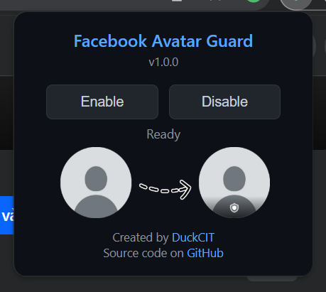

Facebook Avatar Guard allows <strong>toggle</strong> Facebook profile picture <strong>guard</strong>.

<h2 align="center">Facebook Avatar Guard</h2>

 

This extension is an <strong>open-source</strong> MIT-licensed <strong>browser extension</strong> that allows users to easily enable or disable the <strong>profile picture guard</strong> feature on Facebook. The <strong>profile picture guard</strong> helps protect your profile picture from being downloaded, shared, or misused by others.

## Features

- **Enable shield**: Activate the guard to secure your profile picture.
- **Disable shield**: Turn off the guard when no longer needed.
- **User-Friendly Interface**: Simple and intuitive controls for quick access.

## Installation

1. Download the extension files.
2. Open your browser and navigate to the extensions page.
    - For Chrome: Go to `chrome://extensions/`.
    - For Edge: Go to `edge://extensions/`.
3. Enable "Developer mode" in the top-right corner.
4. Click on "Load unpacked" and select the folder containing the extension files.

## Usage

1. Open the extension from your browser toolbar. 

2. Use the "Enable" button to activate the profile picture guard or the "Disable" button to deactivate it.
3. Refresh your Facebook profile page to see the changes.

## Copyright
© 2025 by Nguyen Trong Duc (DuckCIT). All rights reserved. Feel free to build upon this project, but please credit the original author.

## Disclaimer

This extension is not affiliated with or endorsed by Facebook. Use it at your own discretion.

## License

This project is licensed under the [MIT License](LICENSE).